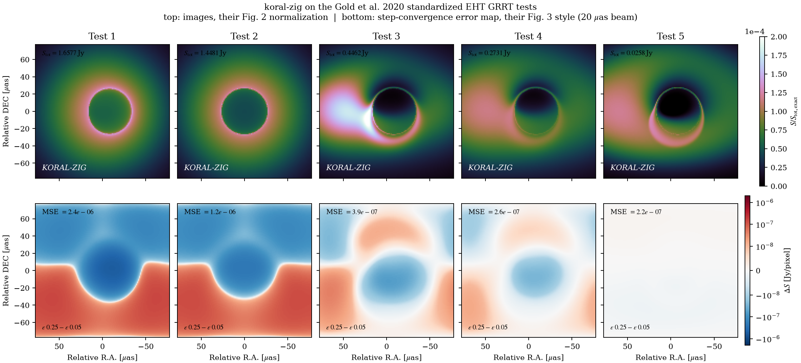

# GRRT imaging with `koral/render/`

The renderer traces null geodesics through KDMP snapshots and integrates
radiative transfer along each ray. It produces images, slow-light movies, light
curves, and FITS files. It reads the simulation TOML so the grid, metric,
thermodynamic constants, and opacity choices match the checkpoint.

The implementation passes the five standardized scenes from the GRRT comparison
in Gold et al. (2020, ApJ 897, 148). Its fluxes fall inside the published
seven-code range and differ from ipole or RAPTOR by at most 0.2%. The
[verification table](#verification-gold-et-al-2020) gives the measured values.

Quick start:

```
zig build -Doptimize=ReleaseFast
# fast-light EHT-ish frame
./zig-out/bin/kdmp2png koral/problems/puffy/puffy3d_sgra_spin.toml \
    dumps/puffy3d_sgra_spin/prims00200.kdmp out.png --size 512 --fov 40 --incl 60
# slow light (retarded-time sampling of the whole series)
./zig-out/bin/kdmp2png koral/problems/puffy/puffy3d_sgra_spin.toml \
    --slow dumps/puffy3d_sgra_spin out.png --fov 40 --incl 60 --stride 8
# 230 GHz image + FITS for eht-imaging
... --nu 230 --dist 8.277 --fits out.fits
# light curve + movie frames
./zig-out/bin/kdmp2lc <toml> --slow DIR lc.txt --nt 32 --frames movie/
# EHT verification suite
./zig-out/bin/goldtest outdir --size 128 --ss 2
```

## Module map

| file | role |
|---|---|
| `render/render.zig` | Core: resumable geodesic integrator `advanceRay` (generic over sampler + pause controller), `traceRay`/`traceRayWith`, `Scene`, `Camera`, `renderImage`, trilinear `sampleData`, KDMP v1/v2 `DumpData` |
| `render/emission.zig` | Monochromatic microphysics (thermal synchrotron Leung+2011, free-free with the Born thermal Gaunt factor ḡ(hν/kT), scattering source; Kirchhoff/LTE pinned by test) |
| `render/image.zig` | PNG (stored-deflate zlib), afmhot colormap, blur, white point, stretch |
| `render/shadow.zig` | Analytic Bardeen critical curve (validation overlay + gates) |
| `render/series.zig` | Slow light: KDMP series scan (header-only), time-interpolating `WindowSampler`, refcounted `FileSource` |
| `render/sweep.zig` | Slow light: 3-phase streaming sweep `renderSlow`, ray plans (`RaySpec`, `uniformPlan`), batched multi-epoch rendering |
| `render/adaptive.zig` | Photon-ring image-plane refinement: vacuum pre-pass + per-pixel quadtree `planRays`, `renderPlan` |
| `render/fits.zig` | FITS image writer (Jy/pixel, ehtim-compatible headers) |
| `render/verify.zig` | Gold et al. 2020 standardized verification scenes |
| `tools/kdmp2png.zig` | The imaging CLI (fast/slow/adaptive/FITS) |
| `tools/kdmp2lc.zig` | Light curves + movie frames (one streaming sweep for all epochs) |
| `tools/goldtest.zig` | The verification runner vs the published flux tables |

Tests live in `koral/tests/render_tests.zig` (registered in `koral.zig`).

## Method

Rays start at a distant static observer's orthonormal tetrad, one per pixel. The
renderer integrates them backward with Δλ < 0 as
  null geodesics directly in the grid's MKS2 coordinates. Christoffels come
  exact-to-roundoff from `metric.compute`'s dual numbers; log-r gives
  near-horizon step refinement for free. RK4 everywhere; a step that would
  cross the polar axis is redone as one short chord in a locally flat
  transverse chart (elementary flatness, the crossing device that fixed
  the old meridian artifact). The step controller caps Δx2 at 10% of the
  distance to the pole.
The camera tetrad uses Gram-Schmidt order (t, φ, r, θ). In Kerr-Schild
  g_rφ = −a sin²θ at any radius, so a (t, r, θ, φ) ordering leaves the
  radial leg carrying O(a) azimuthal momentum and shifts the whole image by
  a·sin i (a bug the Bardeen overlay caught; pinned by a center-ray
  |ξ| < 5/r gate). This ordering is exactly the "photons at image center
  have k_φ = 0" camera convention of the EHT verification paper.
Transfer uses the attenuated-emission solution in invariant form with
  ν̂ = −k·u (camera-normalized). Gray mode integrates I/ν̂⁴ with the sim's
  own gray opacities + M1 scattering source (with the 1 + 3n̂·F̂/Ê dipole);
  `--nu GHZ` integrates I_ν/ν̂³ with the CGS microphysics of emission.zig
  and reports I_ν, T_b, and (with `--dist`) S_ν in Jy.
The scattered part of the monochromatic source is colour-corrected: the
  M1 field is re-emitted as the diluted blackbody f⁻⁴B_ν(fT_rad) (Shimura &
  Takahara 1995) with f(T_rad) from Done et al. (2012, eqs. 1–2), weighted
  by the cell's gray scattering fraction κ_es/(κ_es+κ_abs) so
  absorption-dominated gas stays Planckian. `--fcol off|done12|F` selects
  it (default done12; F = a fixed factor such as 1.7). The f⁻⁴ keeps the
  energy budget identical to gray mode; only the shape hardens (peak × f,
  Rayleigh–Jeans tail × f⁻³). See "X-ray caveats" below for what this does
  not do.
The sigma cut (b²/ρ) and floor cut (atmosphere profile) suppress
  the emission of floor-dominated material but keep its extinction.
* The integrator is **resumable** (`RayState` + `advanceRay(sampler, ctl)`),
  generic over the data source. The fast-light path is bit-identical to the
  pre-refactor loop by construction and by test.

## Verification (Gold et al. 2020)

`render/verify.zig` implements the five standardized imaging tests of the
EHT radiative-transfer code comparison (Gold et al. 2020, ApJ 897, 148,
§3.2): analytic single-fluid Kerr scenes, gaussian cloud/disk
n ∝ exp{−½[(r/10)² + (h cosθ)²]}, pseudo-Keplerian l = l₀R^{3/2}/(1+R),
u_μ = ū(−1, 0, 0, l) in Boyer-Lindquist, j ∝ n ν̂^{−α},
α_ν = A·C·n·ν̂^{−(β+α)} cm⁻¹, β = 5/2, M = 6×10¹¹ cm, d = 2.4×10²² cm,
camera at r = 1000 M, i = 60°, fov 30 M (their camera spec matches this
renderer's conventions exactly). The BL fluid is carried to MKS2 via
u^KS_t = −ū, u^KS_r = ū(2Mr − a·l)/Δ, u^KS_φ = ū·l, gated by a u·u = −1
check against the code's own metric at 10⁻¹². The tracer shares the
production geodesic steppers and mirrors `traceRay`'s monochromatic
transfer. The test therefore exercises the production integration scheme.

Result at the paper's own resolution (128², ss2, `zig build goldtest`):

| test | scene | koral-zig | exact | deviation | published 7-code range | ipole / RAPTOR |
|---|---|---|---|---|---|---|
| 1 | thin sphere, a=0.9, α=−3 | 1.6581 Jy | 1.6465 | +0.71% | [1.6466, 1.6694] ✓ | 1.6604 / 1.6609 |
| 2 | rotating sphere, a=0, α=−2 | 1.4482 Jy | 1.4360 | +0.85% | [1.4361, 1.4710] ✓ | 1.4486 / 1.4486 |
| 3 | disk h=10/3, thin | 0.4463 Jy | 0.4418 | +1.01% | [0.4419, 0.4508] ✓ | 0.4454 / 0.4456 |
| 4 | disk h=10/3, A=10⁵ | 0.2731 Jy | 0.2710 | +0.78% | [0.2709, 0.2763] ✓ | 0.2729 / 0.2729 |
| 5 | disk h=100/3, A=10⁶ | 0.0258 Jy | 0.0255 | +1.20% | [0.0254, 0.0260] ✓ | 0.0258 / 0.0258 |

All five results fall inside the published range. The largest difference from
ipole or RAPTOR is 0.2%; tests 2, 4, and 5 match their printed precision.
Changing `eps` from 0.25 to 0.05 moves total flux by about 0.02%, so the remaining
difference is dominated by camera and pixel conventions.



`tools/goldfig.py` (needs numpy + matplotlib) reproduces their Figures 2
and 3 from `goldtest --fits` output: row 1 is the five images in their
exact Figure 2 normalization (S/S_tot,exact, linear 0..2e−4, cubehelix,
RA/DEC in μas, West right). Morphology matches panel by panel, including
the Doppler-crescent side (east/left; direct comparison shows our
FITS orientation lands on their convention, not mirrored). Row 2 is the
Figure 3 analog: beam-convolved ΔS [Jy/pixel] on their symmetric-log
scale, differencing production (eps 0.25) against the step-converged
reference (eps 0.05). The paper's exact per-pixel images are not
published, so this shows the internal integration-error map (shared
camera systematics cancel); MSEs are 2e−7..2e−6, at the level of the
best codes' vs-EXACT MSEs in their Table 3 (BHOSS 1.7e−6, ODYSSEY 2.9e−6
on test 1; ipole 7.4e−5, GRTRANS 1.9e−4).

Workflow:
```
./zig-out/bin/goldtest DIR --size 128 --ss 2 --eps 0.25 --fits
./zig-out/bin/goldtest DIR --size 128 --ss 2 --eps 0.05 --fits --tag ref
python3 tools/goldfig.py DIR        # writes DIR/goldfig.png
```

A CI gate runs all five scenes at 16² within 2.5% of the exact flux (measured
+0.9…+1.8% there; any real physics error shifts these by tens of %).

Not implemented from the paper: the §3.1 deflection-angle quadrature (our
Bardeen-curve, E/L-conservation and null-norm gates cover geodesic
accuracy), the §5.4 GRMHD-snapshot cross-test (non-public data), and
polarized variants (no polarization yet).

### Other physics gates (render_tests.zig)

* Kerr E = −k_t, L = k_φ conservation + null norm through the strong field,
  including polar-axis crossings; Schwarzschild capture at b_crit = √27 M.
* Capture boundary on the analytic Bardeen curve (a = 0.9375, conserved
  (ξ, η) to < 0.5%); `--screen` renders the shadow with the curve overlaid.
* LTE: source function j/χ = B(T) exactly (gray and monochromatic).
* Colour correction (against the papers): Done+2012's quoted anchors
  (1.6 at kT = 1 keV, 2.34 at 4×10⁵ K, 2.4 at 3×10⁵ K, 2.7 at 10⁵ K), the
  Shimura & Takahara 1.7 ± 0.15 over kT 0.4–0.8 keV, the Davis & El-Abd
  (2019) 1.4–2 envelope for 0.3–1.5 keV with their eq. 11 offset pinned;
  the diluted blackbody conserves σT⁴/π to 10⁻³, moves the peak by f and
  the RJ tail by f⁻³; a thick scattering slab traced through the production
  path hardens by exactly f⁻⁴B_ν(fT)/B_ν(T) (2%), `--fcol 1` is bit-identical
  to `off`, and the blend returns Kirchhoff's S = B where absorption dominates.
* Free-free: the thermal Gaunt factor is the Born average
  ḡ(u) = (√3/π)e^{u/2}K₀(u/2), u = hν/kT_e (limits (√3/π)ln(4kT/ζhν) and
  √(3kT/πhν); ḡ ≈ 12 at 230 GHz for hot gas, ≈ 0.8 at hν ≈ kT). Gates: both
  asymptotes, ḡ(1) = 0.8403, the emission-weighted mean ∫ḡe^{−u}du = 2√3/π
  = 1.10 (the gray opacity's total uses 1.2), and j_ν ∝ ḡ(u)e^{−u}, the
  free-free spectral shape being the Gaunt factor itself. A constant ḡ is
  right only near u ≈ 1; across 0.1–10 keV it mis-tilts the continuum by
  up to 2× at the band edges, which matters once spectra are folded through
  an X-ray response. The relativistic factor 1 + 4.4×10⁻¹⁰T_e matches the
  gray opacity (PHYSICS.md §5.3).
* Timing (slow light): radial KS flight time = Δr + 4M ln((r_c−2M)/(r_e−2M))
  to < 0.05 M over 1000 M. The renderer integrates the Shapiro delay;
  consecutive photon-ring windings (Δφ + 2π) delayed by the photon-orbit
  period 2π·3√3 ≈ 32.65 M to < 0.5 M; a time-localized flare arrives
  retarded by exactly the traced travel time.
* Slow-light identity: with a static series, both `traceRayWith` and the
  full 3-phase sweep are BIT-IDENTICAL to fast light; batched multi-epoch
  sweeps are bit-identical to independent per-epoch sweeps.

## Slow light

Fast light samples one snapshot everywhere, so every pixel shows the flow at
one instant. Slow light (`--slow DIR`) samples the fluid at each
photon's own retarded coordinate time x⁰, which the integrator carries
exactly (gravitational + Shapiro delays and photon-ring lags included).

Streaming works because g^tt < 0 outside the horizon in (M)KS coordinates. Time
is a global function, and every backward ray's x⁰ decreases strictly,
ergosphere and horizon included (KS time is horizon-regular; in BL this
would be pathological). One newest→oldest pass over the dump series
therefore suffices:

1. Free flight runs from the camera to `--rslow` on the reference frame.
2. The window sweep slides a pair of consecutive frames `[t_lo, t_hi]`
  toward the past; each active ray advances (`WindowSampler` interpolating
  linearly in time at its own x⁰) until x⁰ < t_lo, then parks; the window
  slides when all are parked. Each frame is read from disk exactly once; at
  most two frames + the reference stay resident (an 18 GB series renders
  in ~600 MB). A ray that exits `--rslow` spatially can never re-enter
  (one radial turning point outside the photon shell) and joins the tails.
3. The tails finish on the reference frame.

Deterministic at any thread count. Series-edge extrapolation holds the end
frame and is counted (`Stats.clamped_*`, `past_start`). The sampler's lerp
is written `a + w·(b−a)` so identical frames reproduce fast light exactly.

The `--rslow` setting changes which variability survives. The static zone removes
variability originating outside it. For compact synchrotron sources with emission
within ~20 M) the default 40 M is right. The sgra_spin dumps' 230 GHz flux
is bulk free-free: rslow 40 gave modulation ~10⁻⁶ while fast-light frames
8.5 M apart differ by 3.5×10⁻³; rslow 200 recovered the true rate, at the
cost of a lookback that outruns the series (watch "rays past start").

`--tobs T` selects the simulation time imaged at the hole. Photons arrive at
t = T + r_cam. Default T = t_last − rslow. `--stride N` keeps every Nth
frame counting from the newest. Dump cadence is not assumed uniform; the
scanner adopts the newest frame's shape and skips foreign frames (the
sgra_spin dir contains three frames of a different-resolution restart).

Cost: a slow frame ≈ a fast frame of the same data (measured 7.8 s vs
7.6 s at 96²) + one streaming read of the series.

## Adaptive photon-ring refinement

The n-th lensed subring is exponentially demagnified (width ∝ e^{−πn} at
a = 0), far sub-pixel at production fov. `--adapt D` runs a vacuum
pre-pass (geodesics only, fluid-independent, so one plan serves fast and
slow light): a corner grid records (captured?, flight time), endpoints
first-order-corrected to the exact capture/escape sphere (without this the
final-step overshoot marks the whole frame). A pixel refines when corners
disagree, capture flip, or flight-time spread > `--adapt-dt` (default 5 M;
a photon half-orbit is ~16 M, so the criterion tracks the delay structure slow
light resolves). Marked pixels subdivide as a DFS quadtree to depth D;
leaves are cells whose corners agree (one center ray, weight = area; exact
powers of ¼ summing to 1 per pixel). Refinement self-limits by gradient
(a smooth cell of size s stops once s·|∇T| < adapt-dt), so `--adapt-dt` is
the cost knob. Probes get their own step budget (`probe_max_steps`): a
probe that cannot resolve capture-vs-escape is pinned to the shell, which
is the refine signal. With matter, near-critical RT rays terminate via τ;
in `--screen` (vacuum) pass `--max-steps 15000`.

## EHT pipeline (tiers 1-2)

* **FITS export.** `--fits PATH` also needs `--nu` and `--dist`. It writes the raw
  pre-blur image as BITPIX −64, BUNIT='JY/PIXEL' (I_ν·Ω_pix·10²³), CDELT
  in degrees (RA negative), CRVAL + OBSRA/OBSDEC, FREQ, MJD,
  `ehtim.image.load_fits` → `im.observe(...)` works directly. `--ra/--dec`
  default to Sgr A* J2000, `--mjd` to 57850 (2017 Apr 7). Rows are flipped
  to FITS bottom-up; +α → −RA (east-left); rotate in post when comparing
  to a source with known PA. The FITS flux sum is verified identical to
  the CLI's independent Jy computation.
* **Light curves.** `tools/kdmp2lc.zig` writes S_ν(t) and the modulation index
  M = σ/μ, the EHT Sgr A* Paper V variability observable (the constraint
  most GRMHD models fail). The tool batches all epochs into one streaming sweep
  using `SlowOpts.t_cam_of`, with each epoch aimed at its own pixel block. The
  series is still read once. `--frames DIR` writes
  per-epoch PNGs with a shared white point (flicker-free movie frames).
  The tool warns when a φ-wedge domain makes variability artificially
  m-periodic.
* **Current `sgra_spin` data.** Its 230 GHz flux is
  ~1.2×10⁻⁵ Jy vs Sgr A*'s 2.4 Jy (thermal T_b ~ 2×10⁵ K, no hot
  synchrotron electrons; T_e ≡ T_gas single-temperature). That number was
  measured with the former constant ḡ_ff = 1.2; the Born Gaunt factor is
  6–12 at these hν/kT, so the bulk free-free flux should come out several
  times higher on re-render (still ≪ 1 mJy; not yet re-measured). The series is
  MRI-unresolved (qmri verdict) and one hour long, and the π/2 wedge
  imposes m=4 symmetry. A physical EHT comparison needs a separate electron
  temperature model and longer, resolved full-2π runs.

## X-ray caveats

The monochromatic mode was built for the mm band. What the colour
correction buys, and what it does not:

* It is the standard first-order treatment of a scattering-dominated
  atmosphere (Shimura & Takahara 1995; Davis et al. 2005; Done et al.
  2012; Davis & El-Abd 2019) and makes the soft continuum below a few keV
  defensible. Without it the scattered light was a blackbody at T_rad,
  too soft by f ≈ 1.5–2 at the peak.
* It adds no Comptonized tail. Wielgus et al. (2022) post-processed these
  puffy discs with HEROIC and found a thermal peak near 3 keV plus a
  power law of photon index ≈ 4 above 10 keV; Lančová et al. (2022) showed
  colour-corrected disc models mis-recover puffy-disc parameters. Nothing
  above the thermal peak should be trusted from this renderer.
* Magnetically supported atmospheres harden beyond the prescription
  (Blaes et al. 2006), so Done+2012 is a floor for puffy discs.
* T_e ≡ T_gas everywhere; the tenuous puffy layer and funnel radiate at
  the ion temperature. No lines, no edges (continuum processes only).
* Interstellar absorption is not applied; add it downstream (SIMPUT/XSPEC).

## Tool reference

`kdmp2png <toml> <kdmp|--slow DIR [ref.kdmp]> [out.png]`. See the header of
`tools/kdmp2png.zig` for the full flag list: camera (`--size --fov --incl
--phi --rcam --ss`), physics (`--nu --fcol --dist --sigma-cut --floor-cut --tau`),
integration (`--eps --max-steps --threads`), display (`--gamma --wp
--blur`), validation (`--screen`), slow light (`--slow --tobs --stride
--rslow`), refinement (`--adapt --adapt-dt`), export (`--fits --ra --dec
--mjd`).

`kdmp2lc <toml> --slow DIR [out.txt]`, epochs (`--t0 --t1 --nt`), physics
(`--nu --fcol --dist`), movie (`--frames DIR`), plus the shared camera/slow-light
flags.

`goldtest [outdir] --size N --ss N --eps E --tests 12345`, the
verification suite vs the published tables; writes per-test PNGs.

KDMP v1 (32-byte header) is accepted by the renderer's loader only;
`io/dump.zig` stays v2-strict on purpose (restart contract).

## Known limitations / next

* No polarization. This blocks EHT β₂/EVPA comparison, a strong MAD/spin
  discriminator.
* Single-temperature electrons (T_e = T_gas), dominates 230 GHz
  synchrotron uncertainty for RIAF-regime sources.
* No Comptonization beyond the colour correction of the scattered source
  (see "X-ray caveats"); a Monte Carlo post-processor is the real fix.
* Slow light interpolates primitives linearly between frames (standard
  practice); no higher-order time interpolation.
* GPU/Metal port sketched but not built (bake Γ into a 2D texture,
  microphysics per-cell, f32 kernel).
